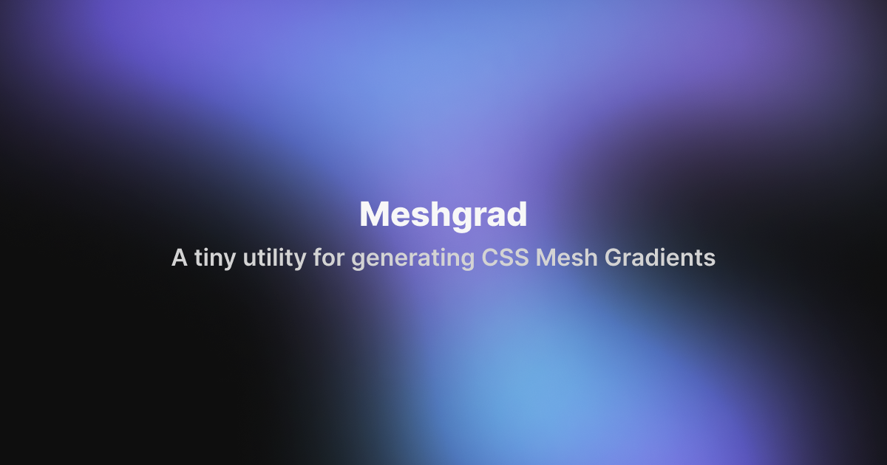

<p align="center">

</p>

# 🎨 Meshgrad  

Meshgrad is a tiny utility to generate native-CSS Mesh Gradients.

[Demo - meshgrad.cretu.dev](https://meshgrad.cretu.dev/)

## Install

```bash
$ npm install meshgrad
```

## Use

### Options:
- length: *number* - ammount of color stops
- baseColor: *string* - hex string that specifies the root color
- hash: *number* - specify a number that will generate the same position each time

### Vanilla Javascript

```js
<script type="module">
  import { generateMeshGradient } from "https://cdn.skypack.dev/meshgrad";

  // Number of color stops
  const ELEMENTS = 6;

  document.getElementById("box");
  box.style = generateMeshGradient(ELEMENTS);
</script>

<div id="box" class="..." />
```

### Svelte

```js
<script>
import { generateMeshGradient } from 'meshgrad';

// Number of color stops
const ELEMENTS = 6;
</script>

<div style={generateMeshGradient(ELEMENTS)} class="..."/>
```

### React JSX

```jsx
import { generateJSXMeshGradient } from "meshgrad";

// Number of color stops
const ELEMENTS = 6;

export function App() {
  return <div style={generateJSXMeshGradient(ELEMENTS)} className="..." />;
}
```
